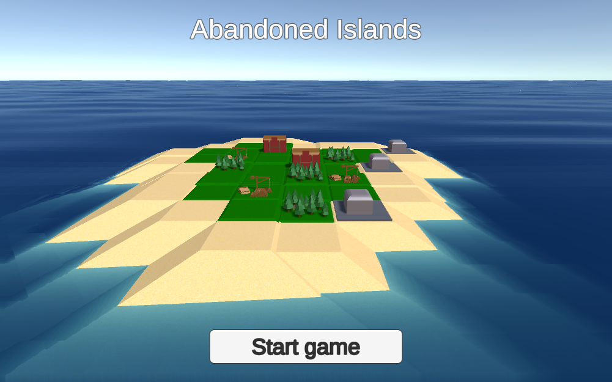

# UnityVolumeRendering
A gamejam project done at work.

The goal of this game is to abandon your island with as many people as possible.
Build on the island to collect resources from each tile. Build houses to increase your population (which costs food) and build shipyards to send your population away from the island.

This was made in one day, so there are still plenty of improvements that can be done.
Pull requests are welcome!
